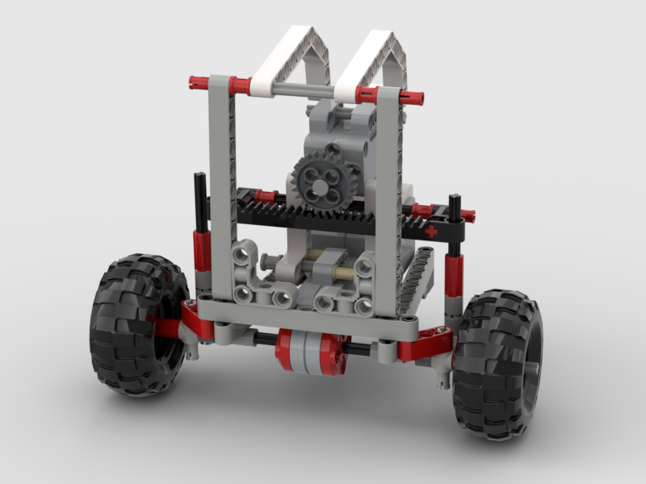

# Studienarbeit: Mars Science Laboratory Curiosity Rover

Repository contains LaTeX sources of the paper as well as Python source code written to make the Rover rove. :rocket:

### Meilensteine

| # | Meilenstein | Termin | Status |
| --- | --- | --- | --- |
| M01 | Basis-Installation und Konfiguration Raspberry Pi | 20.10.2019 | DONE |
|     | Entwurf in BrickLink Studio | 20.10.2019 | 50 % |
| M02 | Steuerung Rover über Sprachkommandos | 03.11.2019 | TODO |
| M03 | Basis-Installation und Konfiguration Pixy-Kamera | 10.11.2019 | TODO |
| M04 | Erkennung von Wasserobjekten und Sprachausgabe | 24.11.2019 | TODO |
| M05 | Sechsrädriges Antriebssystem für unebenes Gelände | 01.12.2019 | TODO |
| M06 | Dokumentation mit BrickLink Studio (Version 2.0.10) | 08.12.2019 | TODO |

#### Definitions of Done
- DOD-M01: 
  - Raspberry-Pi-Installation (hier: Raspbian for Robots von Dexter Ind.)
  - BrickPi-Hardware-Aufbau inklusive Gehäuse zur Verbindung mit LEGO-Rover
  - prototypische Aktuatorsteuerung über Python-Script (Anschluss Batterie-Pack, Nutzung der BrickPi3-Library)
- DOD-M02:
  - Einbindung einer Spracherkennungs-Bibliothek
  - Erkennung der englischen Kommandos "Start", "Stop", "Move Left", "Move Right"
  - Ausführung bestimmter Funktionen nach Erkennung der o. g. Kommandos -> vorerst Dummys mit Konsolenausgabe

#### Backlog
- Fertigstellung des Entwurfs in BrickLink-Studio - Aktueller Status: vordere zwei Achsen und Lenkung Vorderachse

- Greifarm und -steuerung 

### Benötigte Teile (unverbindlich)
- 2x Joint 62520c01 (erhalten)
- Axles with stops (teilweise vorhanden)
- 6x Stoßdämpfer (bestellt)
